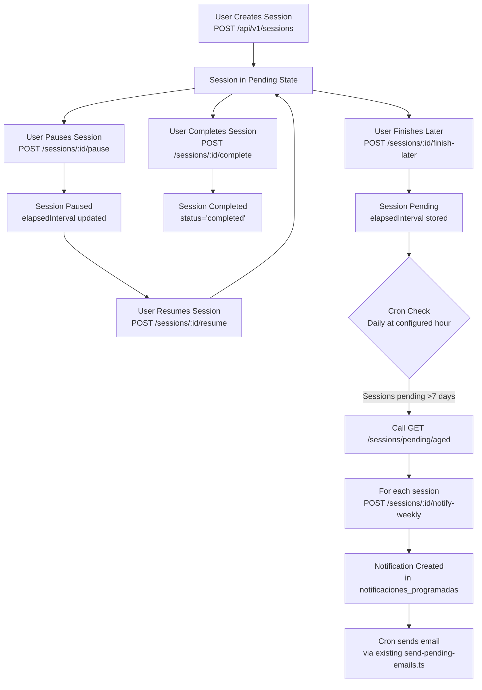

# Concentration Sessions API Specification

## Overview

This document specifies the complete API implementation for Concentration Sessions in Focus-Up, including endpoints, services, DTOs, middlewares, and cron workflows.

## Database Schema

The `sesiones_concentracion` table includes all required fields:

- id_sesion (sessionId)
- id_usuario (userId)
- titulo (title)
- descripcion (description)
- estado (status: 'pending' | 'completed')
- tipo (type: 'rapid' | 'scheduled')
- id_evento (eventId)
- id_metodo (methodId)
- id_album (albumId)
- tiempo_transcurrido (elapsedInterval: INTERVAL)
- fecha_creacion (createdAt)
- fecha_actualizacion (updatedAt)
- ultima_interaccion (lastInteractionAt)

## Session Lifecycle Workflow



## Endpoints

### POST /api/v1/sessions

- **Purpose**: Create new concentration session
- **Auth**: JWT required
- **Body**:

```json
{
  "title": "optional string",
  "description": "optional string",
  "type": "required: 'rapid'|'scheduled'",
  "eventId": "optional integer",
  "methodId": "optional integer",
  "albumId": "optional integer",
  "startTime": "optional ISO timestamp"
}
```

- **Response 201**:

```json
{
  "sessionId": 123,
  "userId": 51,
  "title": "Session title",
  "description": "...",
  "type": "rapid",
  "status": "pending",
  "eventId": null,
  "methodId": 5,
  "albumId": 2,
  "elapsedInterval": "00:00:00",
  "elapsedMs": 0,
  "createdAt": "2025-11-20T12:00:00",
  "updatedAt": "2025-11-20T12:00:00"
}
```

### GET /api/v1/sessions/:sessionId

- **Purpose**: Get single session details
- **Auth**: JWT + ownership check

### GET /api/v1/users/:userId/sessions

- **Purpose**: List user sessions with filters
- **Auth**: JWT + ownership check
- **Query**: status, type, fromDate, toDate, page, perPage

### PATCH /api/v1/sessions/:sessionId

- **Purpose**: Update session metadata
- **Auth**: JWT + ownership
- **Allowed fields**: title, description, methodId, albumId

### POST /api/v1/sessions/:sessionId/pause

- **Purpose**: Pause session timer
- **Behavior**: Updates elapsedInterval, sets lastInteractionAt

### POST /api/v1/sessions/:sessionId/resume

- **Purpose**: Resume session
- **Behavior**: Sets start time to NOW()

### POST /api/v1/sessions/:sessionId/complete

- **Purpose**: Finalize session
- **Validation**: Check method completion if associated

### POST /api/v1/sessions/:sessionId/finish-later

- **Purpose**: Pause and keep pending

### GET /api/v1/sessions/pending/aged

- **Purpose**: Get sessions pending > X days (default 7)
- **Auth**: Internal cron key
- **Query**: days=integer

### POST /api/v1/sessions/:sessionId/notify-weekly

- **Purpose**: Create scheduled notification
- **Auth**: Internal cron key
- **Idempotent**: No duplicate per session/week

## Services

### SessionService

- createSession(payload, userId)
- getSession(sessionId, userId)
- listSessions(filters, userId)
- pauseSession(sessionId, userId)
- resumeSession(sessionId, userId)
- completeSession(sessionId, userId)
- finishLater(sessionId, userId)
- getPendingSessionsOlderThan(days)

### NotificationService

- createScheduledNotification({userId, sessionId, title, message, scheduledAt})
- checkDuplicateScheduledNotification(sessionId, weekStart)

## Middlewares

- authenticateToken (JWT)
- checkOwnership (session belongs to user)
- snakeToCamelCase (convert request body)
- optimisticConcurrency (check updatedAt)

## Cron Workflow

- Daily execution at configurable hour
- Calls SessionService.getPendingSessionsOlderThan(7)
- For each session, calls NotificationService.createScheduledNotification
- Uses existing email sending infrastructure

## Testing

- Unit tests for SessionService methods
- Integration tests for all endpoints
- Cron integration test for notification creation

## Implementation Plan

1. Create SesionConcentracionEntity that matches the new sesiones_concentracion table.
2. Create DTOs (CreateSessionDto, UpdateSessionDto, SessionResponseDto)
3. Implement SessionService with time calculations and concurrency
4. Implement NotificationService with duplicate checking
5. Create SessionController with all endpoints
6. Implement middlewares for auth, ownership, case conversion
7. Create routes and register in app
8. Update cron script to include session notifications
9. Write comprehensive tests
10. Test end-to-end flow
